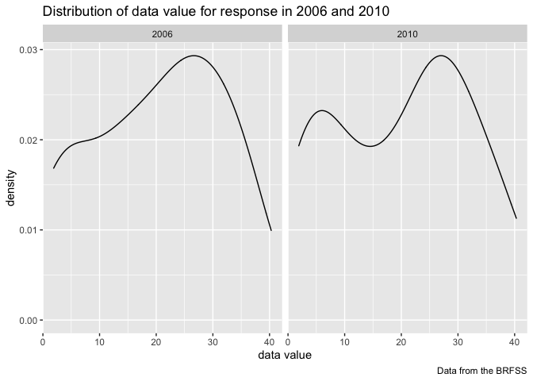
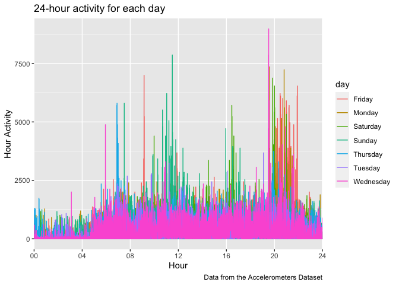

p8105\_hw3\_yz4187
================
Yiwen Zhao
10/19/2021

### Problem1

*The goal is to do some exploration of this dataset. To that end, write
a short description of the dataset, noting the size and structure of the
data, describing some key variables, and giving illstrative examples of
observations. Then, do or answer the following (commenting on the
results of each):*

``` r
instacart = p8105.datasets::instacart %>% 
  janitor::clean_names()

data("instacart")
skimr::skim(instacart)
```

**Description:** This dataset named “instacart” contains 1384617 rows
and 15 columns. It contains 4 character variables and 11 numeric
variables. There are key variables such as “eval\_set”, “product\_name”,
“aisle”, “department”. Except these four variables, all other variables
are numeric.

#### Questions:

*Question: How many aisles are there, and which aisles are the most
items ordered from?*

``` r
instacart %>% 
  group_by(aisle) %>% 
  count(aisle) %>%
  arrange(desc(n))
```

    ## # A tibble: 134 × 2
    ## # Groups:   aisle [134]
    ##    aisle                              n
    ##    <chr>                          <int>
    ##  1 fresh vegetables              150609
    ##  2 fresh fruits                  150473
    ##  3 packaged vegetables fruits     78493
    ##  4 yogurt                         55240
    ##  5 packaged cheese                41699
    ##  6 water seltzer sparkling water  36617
    ##  7 milk                           32644
    ##  8 chips pretzels                 31269
    ##  9 soy lactosefree                26240
    ## 10 bread                          23635
    ## # … with 124 more rows

**Answer:** There are 134 aisles. “Fresh vegetables” are the most items
are order from .

*Question: Make a plot that shows the number of items ordered in each
aisle, limiting this to aisles with more than 10000 items ordered.
Arrange aisles sensibly, and organize your plot so others can read it.*

``` r
instacart_plot = instacart %>%
  count(aisle) %>%
  filter(n >= 10000) %>%
  arrange(desc(n)) %>%
  mutate(aisle = forcats::fct_reorder(aisle, n))

  ggplot(instacart_plot, aes(x = aisle, y = n)) + geom_bar(stat = "identity") +
  labs(
    title = "Number of Items Ordered in Each Aisle",
    x = "Aisle",
    y = "Number of Orders",
    caption = "Data from the Instacart Dataset"
  ) + 
  theme(axis.text.x = element_text(angle = 45, hjust = 1))
```

<!-- -->

*Question: Make a table showing the three most popular items in each of
the aisles “baking ingredients”, “dog food care”, and “packaged
vegetables fruits”. Include the number of times each item is ordered in
your table.*

``` r
instacart %>%
  filter(aisle %in% c("baking ingredients","dog food care","packaged vegetables fruits")) %>%
  group_by(aisle, product_name) %>% 
  summarize(n = n()) %>% 
  filter(n == max(n)) %>% 
  arrange(desc(n)) %>%
  knitr::kable()
```

| aisle                      | product\_name                                 |    n |
|:---------------------------|:----------------------------------------------|-----:|
| packaged vegetables fruits | Organic Baby Spinach                          | 9784 |
| baking ingredients         | Light Brown Sugar                             |  499 |
| dog food care              | Snack Sticks Chicken & Rice Recipe Dog Treats |   30 |

*Question: Make a table showing the mean hour of the day at which Pink
Lady Apples and Coffee Ice Cream are ordered on each day of the week;
format this table for human readers (i.e. produce a 2 x 7 table).*

``` r
instacart %>%
  filter(product_name %in% c("Pink Lady Apples","Coffee Ice Cream"))  %>%
  select(product_name, order_dow, order_hour_of_day) %>% 
  group_by(product_name, order_dow) %>% 
  summarize(mean_hour = mean(order_hour_of_day)) %>%
  spread(key = order_dow, value = mean_hour) %>% 
  rename("Product Name" = "product_name", "Saturday" = "6", 
         "Sunday" = "0", "Monday" = "1", "Tuesday" = "2", 
         "Wednesday" = "3", "Thursday" = "4", "Friday" = "5") %>%
  knitr::kable()
```

| Product Name     |   Sunday |   Monday |  Tuesday | Wednesday | Thursday |   Friday | Saturday |
|:-----------------|---------:|---------:|---------:|----------:|---------:|---------:|---------:|
| Coffee Ice Cream | 13.77419 | 14.31579 | 15.38095 |  15.31818 | 15.21739 | 12.26316 | 13.83333 |
| Pink Lady Apples | 13.44118 | 11.36000 | 11.70213 |  14.25000 | 11.55172 | 12.78431 | 11.93750 |

### Problem 2

*First, do some data cleaning:*

include only responses from “Excellent” to “Poor” organize responses as
a factor taking levels ordered from “Poor” to “Excellent”

``` r
brfss_data =
  brfss_smart2010 %>% 
  janitor::clean_names() %>% 
  filter(topic == "Overall Health") %>% 
  mutate(response = fct_relevel(response, c("Poor", "Fair", "Good", "Very good", "Excellent"))) %>%
  arrange(response)
```

*Using this dataset, do or answer the following (commenting on the
results of each):* \#\#\#\# Questions:

*Question: In 2002, which states were observed at 7 or more locations?
What about in 2010?*

``` r
brfss_data %>% 
  filter(year == 2002) %>% 
  group_by(year, locationabbr) %>%
  distinct(locationdesc) %>%
  count() %>%
  filter(n >= 7)
```

    ## # A tibble: 6 × 3
    ## # Groups:   year, locationabbr [6]
    ##    year locationabbr     n
    ##   <int> <chr>        <int>
    ## 1  2002 CT               7
    ## 2  2002 FL               7
    ## 3  2002 MA               8
    ## 4  2002 NC               7
    ## 5  2002 NJ               8
    ## 6  2002 PA              10

``` r
brfss_data %>% 
  filter(year == 2010) %>% 
  group_by(year, locationabbr) %>%
  distinct(locationdesc) %>%
  count() %>%
  filter(n >= 7)
```

    ## # A tibble: 14 × 3
    ## # Groups:   year, locationabbr [14]
    ##     year locationabbr     n
    ##    <int> <chr>        <int>
    ##  1  2010 CA              12
    ##  2  2010 CO               7
    ##  3  2010 FL              41
    ##  4  2010 MA               9
    ##  5  2010 MD              12
    ##  6  2010 NC              12
    ##  7  2010 NE              10
    ##  8  2010 NJ              19
    ##  9  2010 NY               9
    ## 10  2010 OH               8
    ## 11  2010 PA               7
    ## 12  2010 SC               7
    ## 13  2010 TX              16
    ## 14  2010 WA              10

**Answer:** In 2002, state CT,FL,MA,NC,NJ,PA were observed at 7 or more
locations; in 2010, CA,CO,FL,MA,MD,NC,NE,NJ,NY,OH,PA,SC,TX,WA were
observed at 7 or more locations.

*Question: Construct a dataset that is limited to Excellent responses,
and contains, year, state, and a variable that averages the data\_value
across locations within a state. Make a “spaghetti” plot of this average
value over time within a state (that is, make a plot showing a line for
each state across years – the geom\_line geometry and group aesthetic
will help).*

``` r
brfss_plot = brfss_data %>% 
  select(year, locationabbr, locationdesc, response, data_value) %>%
  filter(response == "Excellent") %>%
  group_by(year, locationabbr) %>% 
  summarize(avg_value = mean(data_value))
```

    ## `summarise()` has grouped output by 'year'. You can override using the `.groups` argument.

``` r
ggplot(brfss_plot, aes(x = year, y = avg_value)) + geom_line(aes(color = locationabbr)) +
  labs(
    title = "Average Value over time within a state",
    x = "Year",
    y = "Average Value",
    caption = "Data from the BRFSS"
  ) 
```

\[\](p8105\_hw3\_yz4187\_files/figure-gfm/make a “spaghetti”
plot-1.png)<!-- -->

*Question: Make a two-panel plot showing, for the years 2006, and 2010,
distribution of data\_value for responses (“Poor” to “Excellent”) among
locations in NY State.*

``` r
brfss_data %>% 
  filter(year %in% c(2006, 2010), 
         locationabbr == "NY",
         response %in% c("Poor","Fair","Good","Very good","Excellent")) %>% 
  group_by(year, response, data_value) %>%
  ggplot(aes(x = data_value)) + 
  geom_density(alpha = 0.4) + 
  facet_grid(~ year) +
  labs(
    title = "Distribution of data value for response in 2006 and 2010",
    x = "data value",
    y = "density",
    caption = "Data from the BRFSS"
  ) 
```

<!-- -->

### Problem 3

*Load, tidy, and otherwise wrangle the data. Your final dataset should
include all originally observed variables and values; have useful
variable names; include a weekday vs weekend variable; and encode data
with reasonable variable classes. Describe the resulting dataset
(e.g. what variables exist, how many observations, etc).*

``` r
accel_data = 
  read.csv("accel_data.csv") %>%
  janitor::clean_names() %>%
  mutate(weekday_vs_weekend = ifelse(day %in% c("Saturday", "Sunday"),"weekend", "weekday")) 
```

**Description:** The Accelerometers dataset contains 35 rows and 1440
variables. Variables includes “week”, “day\_id”, “day” and “activity 1-
1440”.

*Traditional analyses of accelerometer data focus on the total activity
over the day. Using your tidied dataset, aggregate accross minutes to
create a total activity variable for each day, and create a table
showing these totals. Are any trends apparent?*

``` r
accel_table = 
  pivot_longer(
    accel_data,
    activity_1:activity_1440,
    names_to = "time",
    names_prefix = "activity_",
    values_to = "value"
  ) %>%
  mutate(time = as.integer(time)) %>%
  group_by(week, day_id) %>%
  summarise(total_value =  sum(value))
```

    ## `summarise()` has grouped output by 'week'. You can override using the `.groups` argument.

**Answer:** There is no particular trends apparent.

*Accelerometer data allows the inspection activity over the course of
the day. Make a single-panel plot that shows the 24-hour activity time
courses for each day and use color to indicate day of the week. Describe
in words any patterns or conclusions you can make based on this graph.*

``` r
accel_data %>%
  pivot_longer(
    activity_1:activity_1440,
    names_to = "time",
    names_prefix = "activity_",
    values_to = "value"
  ) %>%
  mutate(time = as.integer(time)) %>%
  group_by(day_id, day) %>%
  ggplot(
    aes(x = time, y = value, color = day)
  ) +
  geom_line() +
  scale_x_discrete(
    limits = c(0:1440),
    breaks = c(1,241,481,721,961,1201,1440), 
    labels = c("00","04","08","12","16","20","24")) + 
  labs(
    title = "24-hour activity for each day",
    x = "Hour",
    y = "Hour Activity",
    caption = "Data from the Accelerometers Dataset"
  ) 
```

<!-- -->

**Description:** According to the graph, the most activities happened
between 8-10p.m., and there is not many activities during 0-5 a.m.. We
can also find that the most activities happened on Fridays.
